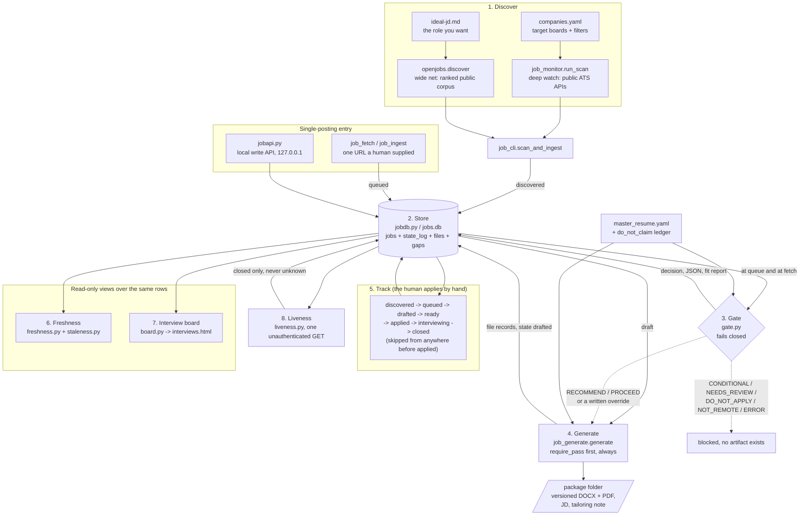

# Architecture

job-hound is a read-only job discovery and application-prep pipeline. It finds
roles by querying public ATS APIs directly, tracks them through a lifecycle in
a local SQLite database, screens them through a fail-closed gate, and generates
tailored resumes and cover letters. The human applies by hand.

Eight stages sit over one shared SQLite system of record. Each stage is a
module that can be imported and called on its own; `job_cli.py` is the only
thing that wires them together and owns state persistence.

## Invariants

These four hold everywhere. If a change breaks one, the change is wrong.

1. **SQLite is the system of record.** `jobs.db` holds the jobs, the audit
   trail, and the file records. There is one database, not one per surface.
2. **`jobdb.py` is the only writer.** Every other module reads through it or
   calls one of its audited setters. The lifecycle state machine
   (`TRANSITIONS`) lives there, in one language, and illegal jumps raise
   `TransitionError`. Callers ask `jobdb.next_states(row)` rather than reading
   `TRANSITIONS` themselves.
3. **The gate is the single choke point every artifact passes through.**
   `gate.require_pass()` is called at the top of `job_generate.generate()`, not
   in the CLI, so every caller inherits it: the CLI, the MCP adapter, and the
   ingest path. It fails closed. There is no bypass flag.
4. **`run_scan` and `generate` stay import-safe and side-effect-free.** They
   take inputs, return data, and print nothing, so a future GUI, skill or
   adapter can call them directly instead of shelling out to the CLI.

## Data flow



## The stages

### 1. Discover

Two sources, both landing `discovered` rows, both read-only.

`job_monitor.py` is the **deep watch**. `run_scan(cfg, seen)` is the
import-safe core: it fetches the public, unauthenticated APIs of the boards
listed in `companies.yaml`, filters by title, location and exclude terms, and
returns the matches. Four ATS families are directly scannable (Greenhouse,
Lever, Ashby, SmartRecruiters), plus Workday through its unauthenticated cxs
endpoint when the entry carries a `{host}/{site}` slug. One company's bad data
must never crash the whole scan; there is a catch-all in the per-company loop,
and it stays.

`openjobs.py` is the **wide net**, and it exists because the deep watch has a
hard ceiling: it can only ever find roles at boards already listed in the
config. `discover(cfg)` ranks a multi-million-posting public corpus against
`ideal-jd.md` and returns candidates best-match first, reaching ATS families
that publish no feed anyone could scan. It costs no API spend on a normal run:
the one call carrying our data is the embedding of `ideal-jd.md`, and that
vector is cached against the sha256 of the text plus the corpus recipe and
dimensions, so it only re-embeds when something it depends on actually
changed. Ranking is local, and the group downloads are anonymous static files.

Discovery **fails safe**, the mirror image of the gate. A lead missed today
comes back tomorrow; a run that raises takes the whole morning digest with it.
Every error path yields zero candidates and a logged reason.

Two dedup layers protect the database: the uid (free where two crawlers agree
on a board slug) and a canonical URL that strips scheme, `www.`, host case,
query and a trailing slash. It deliberately preserves path case, because ATS
ids are case-sensitive and folding them would turn a dedup miss into a silently
dropped lead. The stored `company` is exactly what the board publishes, never
prettified, because it is part of the uid and part of the endpoint URL; the
readable name lives in a separate `company_display` column where a bad guess
can only ever cost an ugly card.

### 2. Store

`jobdb.py`. The pure data layer: no network, no file generation. Tables are
`jobs` (lifecycle state, posting date, gate results), `state_log` (the audit
trail), `files` (versioned document records), and `gaps`.

The state machine:

```
discovered -> queued -> drafted -> ready -> applied -> interviewing -> closed
                 |                                          |
                 +------------------ skipped ---------------+

closed -> applied | interviewing      only when the outcome is 'ghosted'
```

`closed` is terminal for an outcome that was actually decided (rejected,
withdrawn, offer, accepted). A `ghosted` close is the one exception and
reopens, because ghosted means "they stopped replying", not "they said no".
Reopening clears the outcome and the close fields but deliberately does not
restamp `applied_at`, since response-time metrics measure from it. An
`outcome` is refused for any destination but `closed`, because the reopen
guard decides from it.

The database runs in WAL mode, so copying it means `sqlite3 jobs.db ".backup
out.db"` or copying `jobs.db*` with its sidecars. Everything in Python opens
with a busy timeout and waits its turn.

### 3. Gate

`gate.py`, the Fit Gate. It runs at `queue` and at `fetch`, before any prep
artifact exists, and it fails closed.

The split matters: **the LLM extracts and classifies, Python decides.** One
model call (`extract`) reads the full job description against the whole resume
(experience, skills, certs, education, not just a highlights list) and proposes
a verdict per requirement. Then `ledger_sweep` runs the `do_not_claim` tokens
over the raw job description, `enforce` applies the demotion rules, and
`decide` renders the actual decision. A location overlay downgrades a role that
is neither remote nor in the operator's on-site radius.

Decisions, best to worst: `RECOMMEND`, `PROCEED`, `CONDITIONAL`,
`NEEDS_REVIEW`, `DO_NOT_APPLY`, `NOT_REMOTE`, `ERROR`. Only `RECOMMEND` and
`PROCEED` release drafting without a written override.

Its invariants:

- **One-directional.** Code may only make a verdict harsher, never softer, and
  no code path upgrades a NONE.
- **Every error path returns ERROR**, and ERROR blocks exactly like
  DO_NOT_APPLY. No API key, an unfetchable or empty description, an
  unparseable model response, a malformed ledger: all ERROR. A gate that fails
  open is not a gate.
- **The `do_not_claim` ledger is absolute.** It overrules the model outright
  and is not adjudicable, by the model or by a human ruling. It is matched
  twice, once against the extracted requirements and once against the raw text,
  because extractors reliably quote bulleted requirements and reliably drop the
  role-framing prose where disqualifying phrasing actually lives.
- **Nothing unblocks it without a written, audited record**, and that record
  waives exactly one decision. Any fresh gate run discards a standing override,
  because the report it was written against is gone.

Deliberately separate from `fit.py`. `fit.py` is a soft ranker whose job is to
sort leads by attractiveness; the gate is a disqualifier whose job is to say
no. Keeping them apart stops the ranker's optimism from leaking into the gate.

The decision, the raw JSON and the rendered fit report are all persisted on the
job row, so drafting never re-calls the model.

### 4. Generate

`job_generate.py`. `generate()` calls `gate.require_pass()` as its first step,
then fetches the full job description, calls the model with the master resume
plus that description, and writes versioned DOCX (plus PDF when LibreOffice is
present) into a standardized package folder, recording the files in the
database.

Accuracy over keyword stuffing: the generator selects and emphasizes from the
master resume and may never invent an employer, a metric or a skill that is not
there. The tailoring note calls out gaps honestly. No em dashes, enforced in
the prompt and again in a post-process pass.

This stage never applies to anything. It produces documents for human review.

### 5. Track

State transitions through the CLI, the MCP adapter, or the write API. The human
applies by hand, then marks the state. Every transition is validated by
`jobdb.py` and written to `state_log`.

### 6. Freshness

`freshness.py` computes posting age and labels its provenance honestly, because
date quality varies by ATS: Lever, Ashby and SmartRecruiters publish true
first-posted dates, while a Greenhouse board listing only carries `updated_at`,
which changes on any edit and is therefore an upper bound, flagged with a `~`.

Policy: an undatable posting is kept and labelled "age unknown", never silently
dropped, and so is any committed lead (queued, drafted, ready, interviewing) at
any age. Posting age triages the discovery firehose, and a lead already chosen
is not the firehose. Every surface applies both rules identically.

`staleness.py` is the sibling question, and a different one: not how old the
posting is, but how long a committed lead has sat without action. Its clock is
`state_log`, never `updated_at`, because a nightly scoring pass bumps
`updated_at` without changing anything a human decided.

### 7. Interview board

`board.py` renders live interview loops as a self-contained HTML page, one lane
per job in the `interviewing` state, drawn as a transit line with a marker on
the round in play. It exists because `interviewing` is one flat state, so a job
in its final round and a job awaiting a decision are otherwise identical rows.

Each job carries its own ordered round list, because round order is never
modelled globally: a loop that runs two rounds or five just edits its own list,
and any fixed ladder is wrong the first time somebody takes vacation. The
generic node caption is derived from position and never stored, so a relabelled
round cannot put a label naming one number into a slot holding another. The
terminal `decision` node is added at render time and never stored, because the
outcome already lives in `state` and `outcome` and a second lifecycle would
drift from the first.

Pure rendering: rows in, HTML string out. No network, no model call, and no
external references in the output, so the page works from disk and from a
phone.

### 8. Liveness

`liveness.py` asks the public ATS endpoint whether a posting is still up, with
one unauthenticated GET and no model call, so dead leads are cleared before the
gate spends an LLM call finding out the expensive way. `check()` returns
`open`, `closed`, or `unknown`.

**The gate fails closed; the liveness sweep fails safe, and they are mirror
images.** Marking a live posting closed silently removes a real opportunity
that nothing downstream would ever surface again, so every uncertain case
resolves to `unknown`: no public endpoint, a network error, a timeout, a 5xx, a
429, an unparseable body, an unrecognized shape. `--apply` acts only on
`closed`. An `open` or an `unknown` costs one stale row; a wrong `closed` costs
a job.

The endpoint comes from `job_generate.posting_endpoint`, the same helper the
fetchers use. There is deliberately no second copy of those URLs.

## Surfaces

All of these drive the same stage code. None of them may submit an application,
fill an external form, or log into a job site.

- **`job_cli.py`** is the command surface and the only place that wires the
  stages together. The reusable cores `scan_and_ingest` and `refine_pipeline`
  live here, return data, and do no printing, so the CLI and the adapters drive
  one code path.
- **`job_hound_mcp.py`** exposes the pipeline as an MCP server so the search
  can be driven from a chat agent. It is a thin adapter: every tool calls
  existing stage code and returns plain dicts. Its `job_apply` stamps state
  only.
- **`jobapi.py`** is a local write API (FastAPI, bound to `127.0.0.1`, bearer
  token) that a dashboard's lead inbox writes through. Every endpoint is a thin
  wrapper over an audited `jobdb.py` setter. `GET /jobs/{ident}/transitions`
  exists so no UI ever duplicates the state machine.
- **`job_ingest.py`** drains submissions from a spool directory: fetch the
  description, run the gate, auto-draft above a threshold. It calls
  `gate.run_gate()` itself before calling `generate()`, so a bad lead never
  reaches generation at all; `require_pass()` still runs underneath as the
  backstop.
- **`bin/daily.sh`** is the unattended cron run: scan, then the wide net, then
  a weekly liveness sweep, then a deterministic digest. The wide net and the
  sweep are both isolated from `set -e`, because they are nice-to-haves and the
  digest is not. The wide net runs as its own process and reports through a
  status file, in both directions, because failing safe is not the same as
  failing visibly.

## Operating rules that constrain the design

- **Discovery and prep only, never auto-apply.** Everything up to the click is
  automated; a human makes the submission.
- **Public endpoints only.** No scraping behind a login, no CAPTCHA solving, no
  credential automation. The polite User-Agent and the inter-request delays in
  `job_monitor.py` stay.
- **No em dashes**, in generated documents, in code, or in anything the program
  emits.
